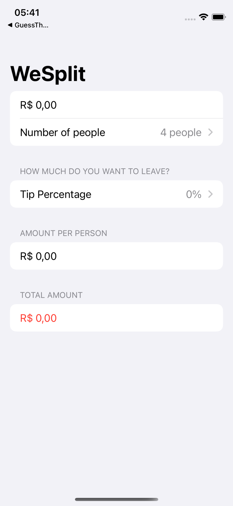
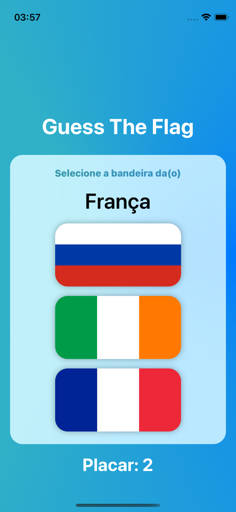
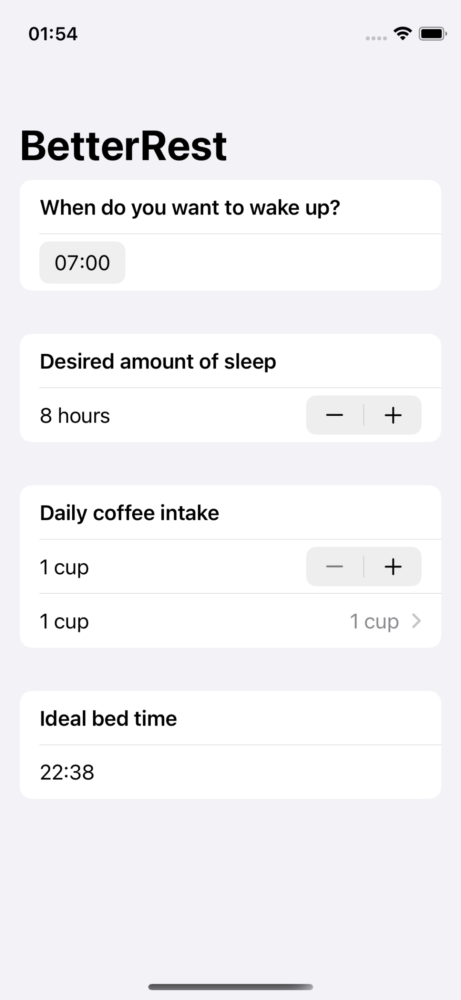

# Hacking With Swift: 100 Days of SwiftUI
Projects based on the course from [Hacking With Swift: 100 Days of SwiftUI](https://www.hackingwithswift.com/100/swiftui) 

[Original GitHub Repository](github.com/twostraws/HackingWithSwift)

## Current finished projects in folder
<table>
<tr>
    <td>
        <figure>
            
            <figcaption>Project 1: WeSplit</figcaption>
        </figure>
    </td>
    <td>
        <figure>
            
            <figcaption>Project 2: Guess The Flag</figcaption>
        </figure>
    </td>
</tr>
<tr>
    <td>
    <figure>
            
            <figcaption>Project 4: Better Rest</figcaption>
        </figure>
    </td>
</tr>
</table>